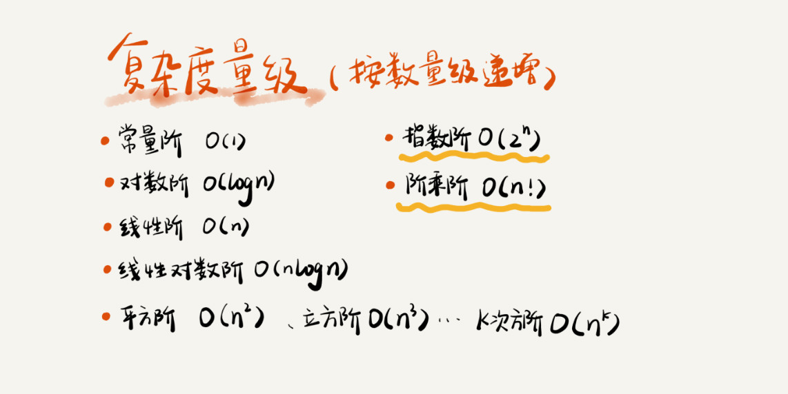

# 复杂度分析

#### 事后统计法

即用测试数据计算算法占用的时间内存等的方法。

1. 测试结果依赖测试环境
2. 测试结果依赖数据规模

#### 时间复杂度/空间复杂度

即不需要具体的测试数据来测试，就可以粗略的估算出算法的执行效率的方法。

##### 大O复杂度表示法

代码执行时间随**数据增长规模**的变化趋势

##### 时间复杂度

* **只关注执行次数最多的一段代码**

```java
int cal(int n) {
    int sum = ；
    int i = 1;
    for (; i <= n; ++i) {   // 这行代码被执行了 n 次，在这段程序中执行次数最多
        sum = sum + i;      // 这行代码被执行了 n 次，在这段程序中执行次数最多
    }
    return sum;
}
```

所以这段代码的时间复杂度就是 O\(n\)

* **加法法则：总复杂度等于量级最大的那段代码的复杂度**

如果 T1\(n\)=O\(f\(n\)\)，T2\(n\)=O\(g\(n\)\)；那么 T\(n\)=T1\(n\)+T2\(n\)=max\(O\(f\(n\), O\(g\(n\)\)\) =O\(max\(f\(n\), g\(n\)\)\)=O\(max\(f\(n\), g\(n\)\)\)

```java
int cal(int n) {

   //这段代码执行了 100 次，所以是一个常量规模，跟 n 的规模无关，即使执行了 10000000 次，对增长趋势并没有影响
   int sum_1 = 0;
   int p = 1;
   for (; p < 100; ++p) {
     sum_1 = sum_1 + p;
   }

   // O(n)
   int sum_2 = 0;
   int q = 1;
   for (; q < n; ++q) {
     sum_2 = sum_2 + q;
   }

   // O(n^2)
   int sum_3 = 0;
   int i = 1;
   int j = 1;
   for (; i <= n; ++i) {
     j = 1; 
     for (; j <= n; ++j) {
       sum_3 = sum_3 +  i * j;
     }
   }

   return sum_1 + sum_2 + sum_3;
 }
```

所以这段代码的时间复杂度就是 O\(n^2\)

* **乘法法则：嵌套代码的复杂度等于嵌套内外代码复杂度的乘积**

如果 T1=O\(f\(n\)\)， T2=O\(g\(n\)\)；那么T\(n\)=T1\(n\)\*T2\(n\)=O\(f\(n\)\)\*O\(g\(n\)\)=O\(f\(n\)\*g\(n\)\).

```java
int cal(int n) {
   int ret = 0; 
   int i = 1;
   // O(n)
   for (; i < n; ++i) {
     ret = ret + f(i);
   } 
} 
 
int f(int n) {
  int sum = 0;
  int i = 1;
  // O(n)
  for (; i < n; ++i) {
    sum = sum + i;
  } 
  return sum;
}
```

cal\(\) 的时间复杂度为 O\(n^2\)

##### 几种常见时间复杂度实例分析



##### 空间复杂度


